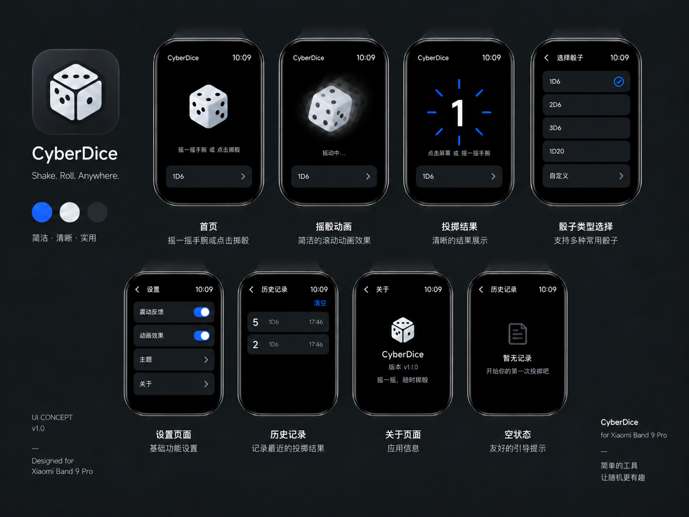

# CyberDice

CyberDice 是一款完全离线运行的 Xiaomi Vela JS 摇骰子应用，包名为 `com.cyberdice`，交付物为 RPK。点击屏幕或摇动手腕即可投掷；结果由本地随机逻辑生成，并以动画和震动完成反馈。



这张图是当前视觉实现的设计依据：黑色背景、白色等距骰子、深灰功能卡、蓝色结果刻度和单一大号结果数值。运行时骰子点数、历史和震动反馈均由程序在本地生成，不会把静态设计图中的示例数值写死。

## 交互

- 点击骰子或摇腕：开始投掷；动画不会影响最终随机结果。
- 持续摇动最长 3 秒即出结果；停稳后重新摇动才会触发下一次。
- 首页上滑：查看历史记录。
- 首页右滑或底部模式卡：打开功能页。
- 左滑：保留给系统返回/退出。

## 设备适配

应用只自动区分大屏与小屏两档，不识别具体型号。默认使用大屏布局，`@media (max-width: 120)` 启用小屏布局；设备名称仅用于说明测试覆盖范围。

小米手环 9 Pro（336×480）与 10 Pro 为矩形大屏基线：骰子 184px、结果环 276px。小米手环 9（192×490）与 10（212×520）通过 Vela 的 `max-width: 120dp` 媒体查询使用独立安全区、上移的功能入口和紧凑列表布局。9/10/10 Pro 仍需完成各自真机验收后才可标为正式支持。

## 开发与验证

```bash
npm test       # 平台无关逻辑与 UI 契约测试
npm run build  # 生成调试 RPK
npm start      # 启动并部署到 Vela 虚拟设备（交互式选择设备）
```

在 AIoT IDE 中打开本项目后，可通过“调试”部署到已选虚拟设备或真机。`sign/` 仅用于本地证书，绝不提交 `certificate.pem`、`private.pem` 或任何真实签名材料。

## 工程结构

```text
00_reference/design/  已确认的 CyberDice UI 设计参考图
src/                 Vela 应用源码、路由、图片、样式与逻辑
tmp/test/            无第三方依赖的自动化测试
tmp/reference/       产品需求与设备适配资料
tmp/project-history/  变更记录
build/                本地构建中间产物（忽略）
dist/                 本地 RPK 产物（忽略）
sign/                 本地签名材料（忽略）
```

详细实现边界见 [AGENTS.md](AGENTS.md)，需求基线见 [产品需求说明](tmp/reference/Wrist_Dice_小米手环9Pro_产品需求与程序设计说明书.md)，设计原图见 [CyberDice UI 设计参考图](00_reference/design/cyberdice-ui-overview.png)。
